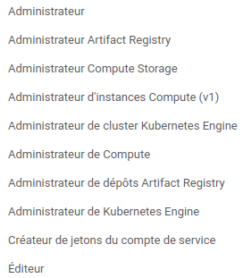

# Prerequisites

First of all, you need to have a google account and a google cloud project. If you don't have one, you can create one [here](https://console.cloud.google.com/).
You also have to enable billing for your project. You can find more information [here](https://cloud.google.com/billing/docs/how-to/modify-project).


Then, you need to create a service account name "terraform@`$project_id`.iam.gserviceaccount.com" with the following roles:



You can find more information [here](https://cloud.google.com/iam/docs/creating-managing-service-accounts).

Finally, you need to create a key for this service account and download it in json format. You can find more information [here](https://cloud.google.com/iam/docs/creating-managing-service-account-keys). This key will be used by terraform to create the infrastructure, so keep it safe.

On gcp, you also need to enable the following APIs:
- Artifact Registry API
- Compute Engine API
- Identity and Access Management (IAM) API (you have already done it if you have created the service account)
- Kubernetes Engine API

# Deployement

## Terraform

First, you need to install terraform. You can find the installation instructions [here](https://learn.hashicorp.com/tutorials/terraform/install-cli).

Then, you need to create a file named `variables.tfvars` with the following content (you can find values on GCP):

```terraform
project_id = "your_project_id"
project_region = "your_project_region"
credentials_file = "path_to_your_credentials_file"
machine_type="your machine type"
machine_zone="your machine zone"
```

Put your credentials file in the terraform directory.

Finally, you can run the following commands (in the terraform directory):

```bash
terraform init
terraform apply --var-file="variables.tfvars"
```

Now, you have your compute engine instance and your kubernetes cluster. You can connect to the compute engine instance with the following command (optional):

```bash
gcloud compute ssh --project $project_id --zone $machine_zone jenkins-server
```

## Ansible

First, you need to install ansible. You can find the installation instructions [here](https://docs.ansible.com/ansible/latest/installation_guide/intro_installation.html).

Then, you need to create a file named `inventory.yml` with the following content:

```yaml
all:
  children:
    jenkins:
      hosts:
        jenkins-1:
          ansible_user: "your_compute_engine_instance_ssh_user"
          ansible_host: "your_compute_engine_instance_ip"
```

Put it in the ansible directory.

Create user admin password:

```bash
ansible-vault encrypt_string 'admin_password' --name 'USER_ADMIN_PASSWORD'
```

Create a file named `group_vars/all.yml` with the following content:

```yaml
GOOGLE_KEY: "path_to_your_credentials_file" (same as terraform)
USER_ADMIN_PASSWORD: "your_password" (you previously created it with ansible-vault)
# TODO: add variables for gcp (deploy script)
```

Put it in the ansible directory.

Then run the following command (in the ansible directory):

```bash
ansible-playbook -i inventory.yml playbook.yml
```

Now, you have your jenkins server with docker and kubectl installed.

## Jenkins

First, you need to connect to the jenkins server. Open web browser and go to `http://your_compute_engine_instance_ip:8080`. You can now connect to jenkins with the following credentials:

- username: admin
- password: "the password you have set in the ansible var file"

Now, enjoy your jenkins server !
