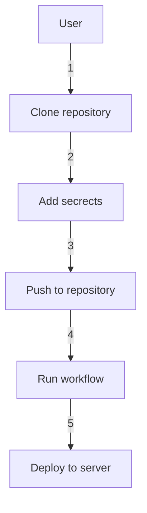

# Architecture

## Overview

## Visual

```mermaid
graph TD

    A[User] -->|1| B[Clone repository]
    B -->|2| C[Add secrects]
    C -->|3| D[Push to repository]
    D -->|4| E[Run workflow]
    E -->|5| F[Deploy to server]

```

```mermaid
graph TD

```
